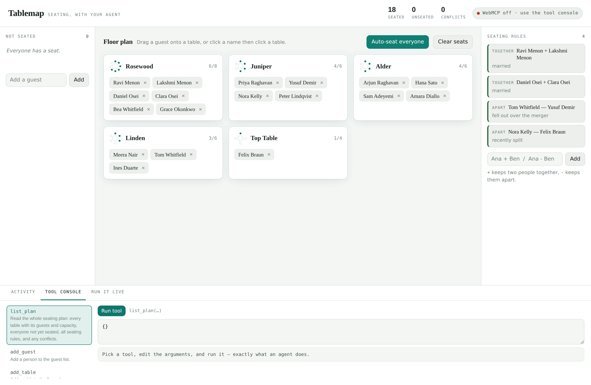

# Tablemap

**A seating chart your agent can actually help with.**

Seating a wedding is the classic task that is easy to *state* and miserable to *do*.
"Keep Tom away from Yusuf, the Menons sit together, and nobody over capacity" takes
four seconds to say and twenty minutes of dragging to satisfy. The constraints live in
the host's head; the fiddly rearranging lives in the UI.

Tablemap puts both halves in the same room. The host drags names by hand. The agent
reads the plan, adds rules, re-seats people, and repairs conflicts — through the same
functions, on the same screen, while the host watches the cards update.

Built for the [WebMCP Challenge](https://webmcp.devpost.com/).



---

## What makes it a WebMCP app, not a chatbot

Three things, all of which are the point rather than decoration:

**The agent and the human share one code path.** Every tool calls the same `seat()`,
`autoSeat()` and `render()` the buttons call. There is no agent-only API and no
separate state to drift out of sync — which is exactly what WebMCP is for.

**Tools appear and disappear with the app's state.** `resolve_conflicts` is registered
only while the plan actually has conflicts, and unregistered via `AbortController` the
moment it doesn't. Agents see a tool list that reflects reality, and the browser fires
`toolchange` when it shifts.

**The agent can point.** `focus_guest` highlights a person on the host's screen. It
changes no data — it exists so the agent can say "this one" and the human can see who
it means.

## The tools

| Tool | What it does | Read-only |
|---|---|---|
| `list_plan` | Whole plan: tables, guests, capacities, rules, conflicts | ✅ |
| `find_conflicts` | Every broken rule and over-capacity table | ✅ |
| `focus_guest` | Highlights a guest on the host's screen | ✅ |
| `add_guest` | Adds a person to the guest list | |
| `add_table` | Adds a table with a capacity | |
| `seat_guest` | Seats or moves a guest | |
| `unseat_guest` | Returns a guest to the unseated list | |
| `add_rule` | Records a `together` or `apart` rule | |
| `auto_seat` | Solves the whole plan from scratch | |
| `resolve_conflicts` | Repairs only the broken parts — **registered only while conflicts exist** | |

## Running it

WebMCP needs an origin-isolated document, so `file://` will not work — serve it over HTTP:

```bash
npx serve .
```

Or, with no Node installed:

```bash
python3 -m http.server 8000
```

Then, to let a real agent drive it:

1. Chrome 149 or newer → `chrome://flags/#enable-webmcp-testing` → **Enabled** → relaunch.
2. Open the served URL.
3. Install the [Model Context Tool Inspector](https://developer.chrome.com/docs/ai/webmcp)
   extension, or open the page in ChatGPT's in-app browser, and ask in plain language.

For a public deployment, [join the WebMCP origin trial](https://developer.chrome.com/blog/ai-webmcp-origin-trial)
so visitors get WebMCP without touching a flag.

**No agent handy?** The **Tool console** tab at the bottom of the page runs every tool by
hand with JSON arguments. The status pill tells you which mode you are in. Nothing about
the app breaks when WebMCP is absent — it degrades to an ordinary seating planner.

## Things to say to the agent

- *"Seat everyone, then tell me what you couldn't satisfy."*
- *"Nora and Felix just broke up — keep them apart and fix the plan."*
- *"Priya's parents should be at the Top Table. Who has to move?"*
- *"Add Iris Bergman and sit her with the college group."*
- *"Which table is over capacity, and who would you move?"*

## What's in here

```
index.html              the entire app — no build step, no runtime dependencies
docs/screenshot-*.png   light and dark reference shots
vercel.json             static deploy config (no build)
LICENSE                 MIT
```

One file, vanilla JS, zero runtime dependencies. Roughly 260 lines of it are the WebMCP
layer; the rest is the seating app it wraps. That ratio is deliberate — WebMCP is meant
to be a progressive enhancement over an app that already works.

Developed against a headless-Chromium Playwright suite that drives the app through the
same tool entry points an agent uses.

## Demo video script (~2:30)

1. **0:00** — Show the plan: five tables, sixteen unseated guests, five seating rules
   already in the rail. Drag one guest onto a table by hand. "This is the boring part."
2. **0:20** — Point at the rules rail — two `together`, two `apart`, one with a note
   like "fell out over the merger." "These constraints can't be expressed by dragging."
3. **0:35** — Ask the agent to seat everyone. Cards fill the tables live. Point at the
   activity log as `list_plan`, `auto_seat` calls land — same UI, same functions.
4. **1:05** — Seat two guests at the same table, then ask the agent to add an apart
   rule between them. Conflict count goes red. `resolve_conflicts` appears in the tool
   list — call out that the tool list itself just changed, and the header count updates
   live (9 tools → 10).
5. **1:35** — Ask the agent to fix it. `resolve_conflicts` runs, the conflict clears,
   and the tool disappears from the list again — it only exists while there's something
   to repair.
6. **2:00** — Grab the mouse and override one seat by hand mid-flow, to show the human
   half never stops working.
7. **2:15** — Ask "who did you move and why" — the agent uses `focus_guest` and the
   highlight follows on the host's own screen.
8. **2:25** — Close on the activity log, agent and human rows interleaved.

## License

MIT — see [LICENSE](LICENSE).
